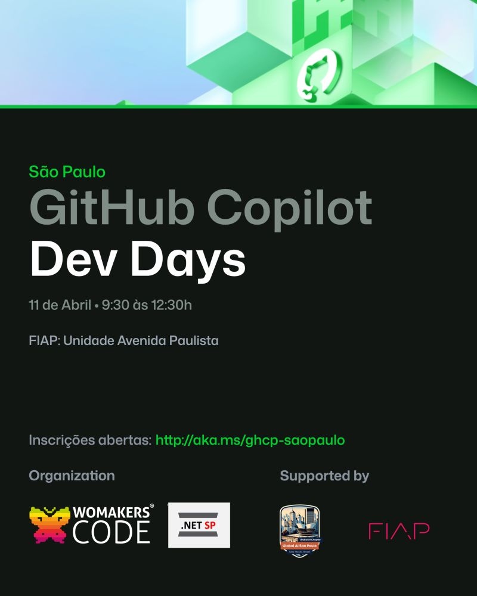
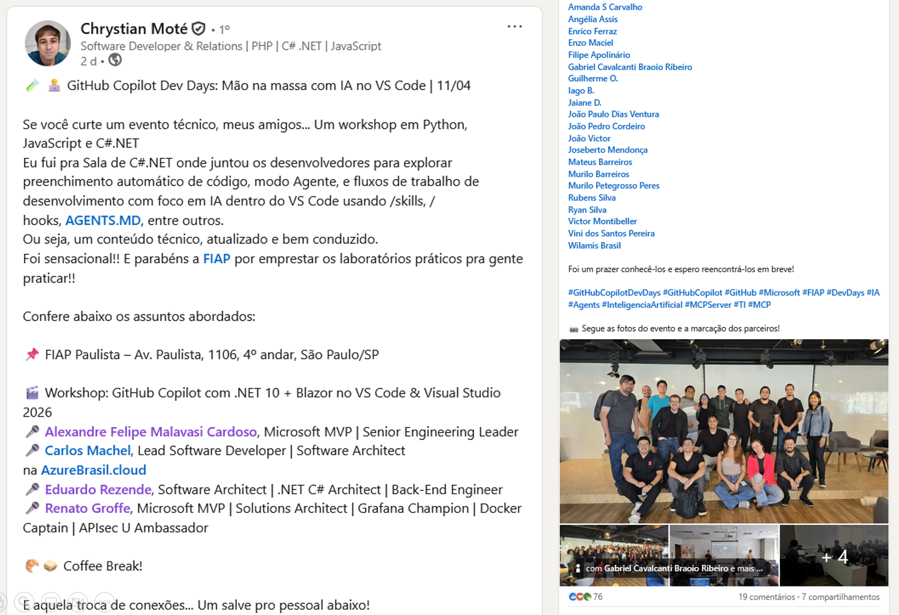
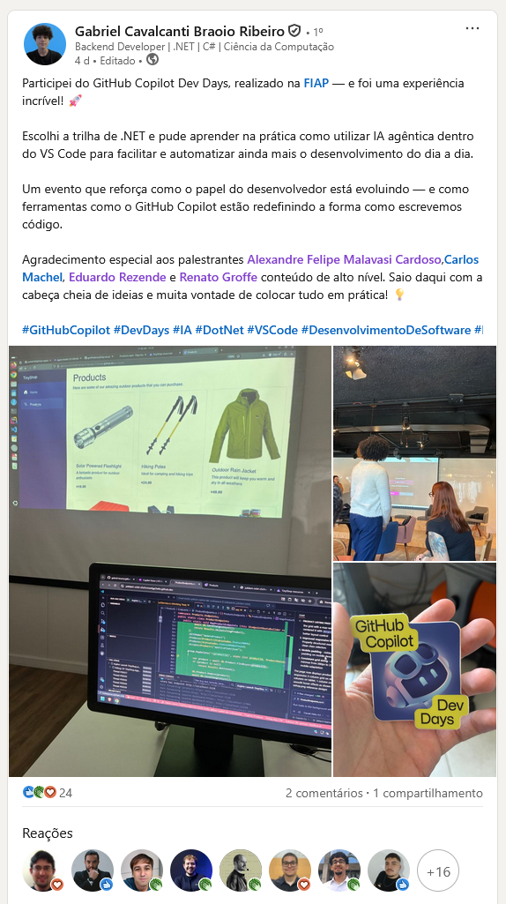
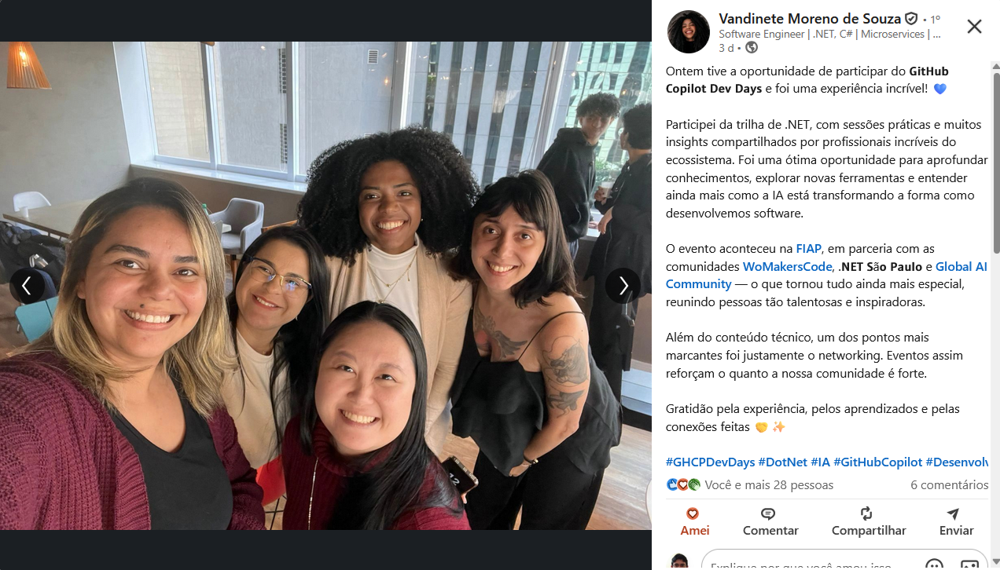

# github-copilot-dev-days-labdotnet_sp-2026-04-info
Informações sobre o laboratório prático de GitHub Copilot realizado em 11/04/2026, em que se abordou a implementação de um projeto com .NET 10 + Blazor em Visual Studio 2026 ou Visual Studio Code.

---

## Referências

[Workshop: GitHub Copilot com .NET 10 + Blazor + Visual Studio 2026 ou VS Code](https://github.com/DotNetSP/github-copilot-dev-days-labdotnet_sp-2026-04)

---

## Informações sobre o evento

Título da apresentação: **Workshop - GitHub Copilot com .NET 10 + Blazor + Visual Studio 2026 ou VS Code**

Evento: **GitHub Copilot Dev Days São Paulo**

Data: **11/04/2026 (sábado)**

Número de participantes: **40 pessoas**

Tecnologias e tópicos abordados: **Inteligência Artificial, LLMs, MCP, GitHub Copilot, Visual Studio Code, Containers, Docker, GitHub Codespaces, .NET, C#, ASP.NET Core, Blazor, Web Asssembly...**

Instrutores/Palestrantes:
- **Renato Groffe (Microsoft MVP, Docker Captain, APIsec U Ambassador, MTAC)**
- **Alexandre Malavasi (Microsoft MVP, MTAC)**
- **Carlos Machel**
- **Eduardo Rezende**

Acesse este [**link**](/img/) para visualizar todas as fotos da apresentação.

Divulgação em redes sociais: [**LinkedIn**](https://www.linkedin.com/feed/update/urn:li:activity:7446906535772995584/) | [**LinkedIn - Pós-Evento**](https://www.linkedin.com/posts/cynthiazanoni_o-github-copilot-dev-days-em-s%C3%A3o-paulo-foi-ugcPost-7450507256946827265-stjJ/)

Formulário utilizado para inscrições: [**Luma**](https://luma.com/w0ej1rmf)

Site do Evento: **https://github.com/microsoft/VS-Code-Dev-Days**

Local: **Av. Paulista, 1106 - 4o andar - Bela Vista - São Paulo-SP - CEP: 01311-000**

Deixamos aqui nossos agradecimentos à **Cynthia Zanoni (Microsoft)** e demais organizadores por todo o apoio para que participássemos como palestrantes **GitHub Copilot Dev Days São Paulo**.

---

